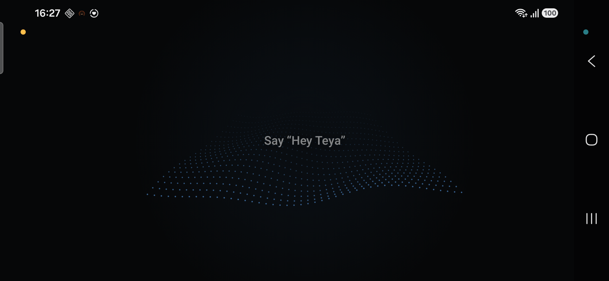

# Teya

> *A family agent for the home — a warm, intelligent presence that listens, understands, remembers, and does. Built on a spare Android phone.*
>
> *A home should feel like it's looking after you, because it knows you.*

<!-- TODO: video demo — replace with embed/link once recorded -->

  
  

---

## a machine that forgets everything

Ask Alexa to set a timer and it works. Ask who's picking the kids up from football, and there's nothing there: no notion of two separate calendars, no memory that this comes up every Tuesday, no way to act on the answer even if it understood the question. Voice assistants were designed in the early 2010s around simple commands — fancy if-then systems. They don't understand context, they forget everything between sessions, and they can't act across apps in any meaningful way. Families use them to set timers and play music, then ignore the rest.

Meanwhile the AI behind ChatGPT and Claude is genuinely intelligent. It sits behind a chat window, though, disconnected from the physical and digital infrastructure of an actual home. Put that same intelligence on a device the whole household shares, instead of one person's chat window, and you get a **smart family agent** that actually helps run the household: an agent that **listens, understands, remembers, and does**.

## any cheap android phone

The idea that makes this buildable at all: **a cheap Android phone is a supercharged Arduino, consumer-ready out of the box.** It already has a display, 4G/5G, a mic and speaker, GPS, a calendar and timer, and it can call an AI model directly, on top of the millions of apps already built for it.

Wall-mount any cheap phone, plug it in, and it becomes the single visible node of an invisible home network. Smart bulbs, locks, calendars, messaging apps: all of it hidden infrastructure. The face on the wall is the only interface the family needs to see.

There's no server behind it, no local agent stack. Today's AI-agent wave runs heavy — people buy Mac Minis to host coding agents and orchestration frameworks locally. Teya needs none of it: the intelligence lives in the cloud, reached with a few API calls per turn, so the hardware is a cheap phone that makes those calls, keeps the screen alive, and drives the device. Any modern Android phone, Android 8.0 (Oreo) or newer, works.

**The mic and speaker weren't built for this, though.** They're tuned for close, arm's-reach use, and picking up a wake word or clear speech across a room asks more of them than that. Early testing is encouraging but limited, and a bigger room may need an external mic array or speaker.

## what it's for

Right now, that's:

- **Shopping list** — "we're out of milk" gets added without being asked twice.
- **Calendar** — add an event by voice, recurring or not, and it invites the rest of the household by email automatically.
- **Timers & alarms** — set one, and it announces out loud, in its own voice, when time's up.
- **Reminders** — "remind me to call the plumber in twenty minutes" or "remind me to bring cupcakes to the school run" becomes a timer or a quiet calendar entry, whichever actually fits.
- **Expenses** — "12 euros for fruit" gets logged and categorized on the spot; ask "how much have we spent this month" and it adds the numbers up exactly, never guessing.
- **Calls** — "Call Grandma," spoken by a five-year-old who can't navigate a dialer, places a normal, hands-free cellular call, but only to someone on an approved family contacts allowlist: no path to dialing an unknown, arbitrary, or premium number.

The biggest beneficiary is whoever in the house carries the mental load: the appointments, the meals, the logistics, the school admin nobody else tracks. Teya becomes a second brain for the household, running quietly in the background. The fuller list, including what's still ahead, lives in [docs/roadmap.md](./docs/roadmap.md).

It's locked down by design: a boxed home appliance fixed in place, running on fresh accounts created solely to operate it, never the family's personal Google, social, or banking logins. **There's nothing personal on it to hijack or steal.** Combined with the calling allowlist, that's what makes it safe to leave on a wall within reach of kids and guests.

Privacy works the same way: it's built into the architecture itself. The household roster, per-person memory, and the contacts allowlist live on the device. Raw conversation transcripts stay unwritten, never touching disk. Only what a turn needs to think and speak, or what the nightly dream needs to consolidate memories, goes to the model.

## part of the family

You expect a family member to recognize you and remember things about you. That's what Teya does: it remembers, and it recognizes who's talking.

Ask it to remember something, and it will: "remember I'm allergic to peanuts" gets saved as a fact about you specifically, or about the household if it isn't about one person. Ask it to forget, and that memory is gone. Everything it's saved can also be reviewed and edited by hand.

Most of what Teya remembers, though, nobody asked it to save. At the end of every conversation, the model distills what was actually worth keeping into one short note, or decides there's nothing worth keeping at all. Instead of saving a transcript of the conversation, Teya saves that note, so there's never a full record of what was said sitting on the device.

**It dreams.** Every night, while the house is asleep, those loose notes get consolidated into durable facts about the household, and anything that hasn't been reinforced fades on a forgetting curve instead of piling up forever. It ages the way a person's memory does, keeping what mattered and letting the rest go quiet. Whatever's been kept comes back on its own, without ever being asked to look it up.

It also knows who's talking. Each household member's voice gets enrolled once, and from then on a small on-device model matches who's speaking against those samples, no cloud speaker-ID service involved. A quiet match just tells two people apart; a confident one lets Teya greet someone by name. That runs alongside the wake word and barge-in detection, both on-device too, so most of the listening happens on the phone before anything reaches the cloud.

## visualization

The whole screen is the control: a short tap wakes her, same as saying "Hey Teya"; a long press opens Admin.

The phone runs horizontal with the particles visualization, vertical with the face — two eyes and a mouth. Switched in Admin (long-press the screen, or just ask Teya — she knows how, same as any other setting), and the pick carries through onboarding and Admin's own background too. A Claude Code skill (`/add-visualization`) scaffolds adding a third.

  

  

## the harness

The agent loop of Teya connects an LLM, TTS, STT, wake word, and VAD models to the phone itself, turning what the model decides into a tool call tied to Android's native SDK: placing a call, adding a shopping-list item, saving a memory.

I wanted onboarding to stay simple, so I stuck to one provider instead of mixing several. It needed to be cheap and multilingual — my own family speaks several languages at home, so Mistral was a very good fit, and it's what runs the reasoning (Mistral Small) plus the speech-to-text and text-to-speech (Voxtral) today. The model itself is swappable, more providers can be added later. Onboarding is where the household enters its own API key.

There's no backend server behind any of this: family data and device control stay local by default, since telephony and the mic/speaker are Android-local APIs a cloud server couldn't reach anyway.

The app is native Kotlin, because it needs deep access to Android's own APIs: reading notifications, acting inside other apps, placing calls, running as an always-on foreground service. Hardware cost and iOS's own lockdown on that kind of background and permission access ruled that platform out. And the app never goes through Play Store or the App Store, so cross-platform's real selling point, one codebase shipped to both stores, was never relevant here.

A call gets placed and then left alone: when a kid says "call Dad," the app dials a normal cellular call and steps aside. It never joins the conversation, and stops managing the call once dialed. A plain cellular call on the SIM: no VoIP, no audio capture, no root.

What actually runs where:

- **On-device (local, no network round-trip):** the wake word (a self-trained `hey_teya` model), barge-in/VAD and echo cancellation for mid-sentence interruption, per-speaker voice ID, the animated on-screen presence, the shopping list, the expense log, and all of family memory, the household roster, aliases, and the contacts allowlist.
- **Cloud, via Mistral:** reasoning (the tool-use loop), speech-to-text, and text-to-speech. This is the only mandatory cloud dependency in the system.
- **Phone APIs:** telephony (outbound calls), calendar and alarms/timers (shipped), and, still ahead, reading other apps' notifications, acting inside other apps, and smart-home control over BLE/Matter.

None of this needs to be impressive on paper. It needs to work quietly enough that nobody in the house thinks about it.

### Documents

- **[docs/roadmap.md](./docs/roadmap.md)** — status: what's built, verified live, and what's next.
- **[LICENSE](./LICENSE)** — Apache-2.0.
